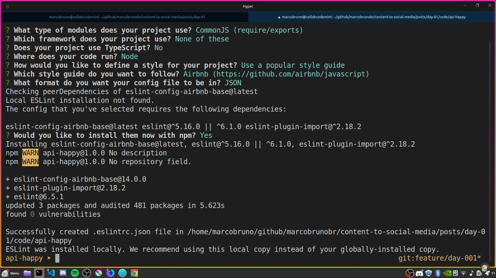
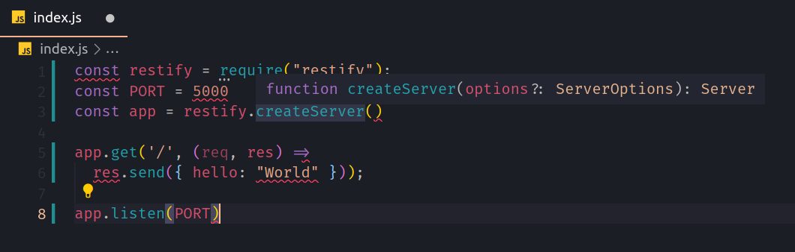
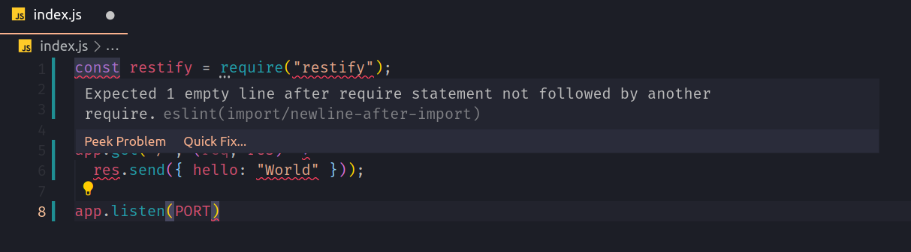
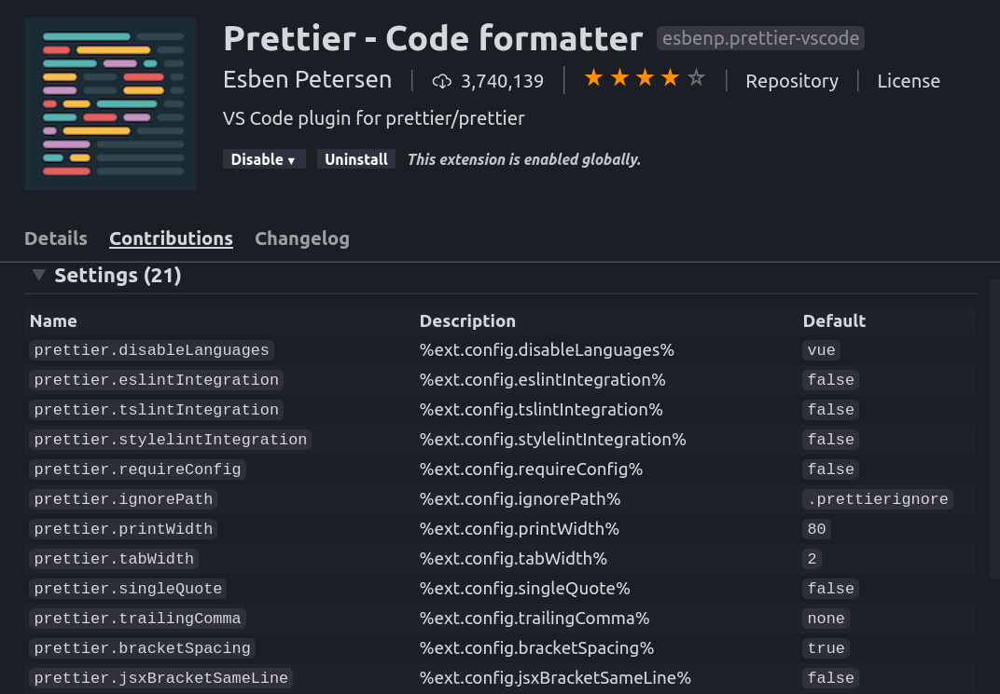

# Como configurar ESLint e Prettier no Node?

Se você não sabe o que é o **ESLint** e **Prettier** eu recomendo você dar uma olhada no [primeiro post](link-pro-post) onde expliquei o que são eles. O objetivo desse post é mais prático.

Como vamos precisar de um projeto base para mostrar como configurar o ESLint e Prettier na sua aplicação Node, logo após os pré-requisitos montarei um _hello world_ (olá mundo) de API com **Restify** que o framework usado pela Netflix e outras empresas a mesma altura.

Se você já tem um projeto criado, por favor só dê uma olhada nos pré-requisitos que estão logo a seguir e depois pode pular para a seção: <a href="#config">Como configurar o ESLint em uma aplicação Node?</a>

## Pré-requisitos

Ter um terminal instalado com o bash, zsh ou fish. Se estiver no windows e não tiver com o bash instalado, por favor use o powershell porque ele terá mais compatibilidade com os comandos que vou mostrar a seguir. Caso tiver qualquer erro fique à vontade para pedir ajuda nos comentários.

Node (10.16.3 ou superior) e npm (6.12.0 ou superior) instalados e por último o Visual Studio Code (VSCode) instalado.

## Criando projeto base?

Por favor, abra o terminal e crie uma pasta com o nome de _api-happy_. A seguir eu uso o comando `mkdir` para criar a pasta e a frente do comando coloco o nome da pasta:

```shell
mkdir api-happy
```

Agora precisamos entra na pasta que acabamos de criar usando o comando `cd` e logo a frente do comando o nome da pasta que queremos entrar:

```shell
cd api-happy
```

Show! Agora que estamos dentro da pasta já podemos iniciar o nosso projeto com **node** usando o **npm** (Node Package Manager). No terminal usaremos o comando `npm init -y`, esse comando criará um arquivo chamado _package.json_ com algumas informações básicas de projeto como:

- name (nome);
- version (versão);
- description (descrição);
- main (arquivo que inicia o projeto);
- scripts (scripts de test e outros);
- keywords (palavras chaves para acharem seu projeto);
- author (autor);
- license (licença).

Agora que já sabemos o que o comando faz, execute ele no terminal, por favor (lembre-se que você tem que estar na pasta do projeto):

```shell
npm init -y
```

Só para certificarmos que deu tudo certo, abra o seu projeto no VSCode e verifique se o arquivo _package.json_ foi criado com sucesso.

O próximo passo, ainda dentro da pasta do projeto, é instalarmos uma dependência (_restify_) no nosso projeto. Para isso precisamos usar o `npm` usando o comando `install`:

```shell
npm install restify
```

Caso você goste de escrever menos, você pode usar o `npm i restify` no lugar do `npm install restify`. Se você está acostumado a escrever o `--save` à frente do nome do pacote (`restify` no nosso caso) para garantir que o pacote vire uma dependência do nosso projeto e o mesmo vá para o **package.json**, isso não é mais necessário. Falando no **package.json**, por favor abra ele no seu VSCode e verifique se foi adicionado a chave a seguir:

```json
...
"dependencies": {
    "restify": "^8.4.0"
  }
...
```

Ainda no seu VSCode com o seu projeto aberto e crie um arquivo chamado _index.js_ e cole dentro dele os códigos a seguir:

```javascript
const restify = require("restify");
const PORT = 5000
const app = restify.createServer()

app.get('/', (req, res) => 
  res.send({ hello: "World" }));

app.listen(PORT)
```

Nesse código que acabamos de ver, de forma bem resumida estamos, criando um servidor com o _restify_ na porta 5000 que saberá responder apenas a rota `/` com um simples `json` de `{hello: "World"}`. A parte mais interessante do código é que não estou seguindo qualquer padrão e de certa forma estamos mesmo a ridicularizar o código, mas estou fazendo isso para te mostrar o poder que teremos após configurarmos o **ESLint** e **Prettier**.

Por último só precisamos pedir para o node subir o nosso servidor com o comando a seguir no terminal:

```shell
node index.js
```

Para esse comando funcionar é necessário executá-lo na pasta do projeto.

<h2 id="config">Como configurar o ESLint em uma aplicação Node?</h2>

Agora chegou a hora de deixar o código amador e subirmos de nível, pensando em qualidade de código e automatização de processos. 

Volte ao terminal e derrube o seu servidor apertando as teclas `ctrl` e `c` juntas. Agora sim, temos o terminal livre para iniciar a configuração do **ESLint**. Para configurar o ESLint é necessário criar um arquivo de configuração chamado _.eslintrc.json_ (esse arquivo pode ter outras extenssões como: js e yaml). Criar esse arquivo manualmente é um tanto chato, felizmente não precisamos fazer, podemos cria-lo de forma assistida usando o comando a seguir:

```shell
npx eslint --init
```

> ### O que o npx?
>
> npx instala o pacote para você de forma global temporariamente, depois que você o utiliza ele é removido. Dessa forma não ficamos mantendo pacotes globais desatualizados e também mantendo eles ocupando um espaço desnecessário. O npx surgiu na versão 5.2 do npm.

Após a execução do comando o terminal fará perguntas sobre a configuração do **ESLint**. Vamos as perguntas feitas, vou tomar a liberdade de fazer uma tradução das perguntas e as respostas que eu recomendo que você deixe selecionada. Não vou explicar todas as possíveis respostas para cada pergunta, mas caso você tenha qualquer dúvida não deixe de perguntar nos comentários:

[](http://www.youtube.com/watch?v=F_fHYicVZi8)
<small>**Vídeo mostrando as respostas**</small>

**Pergunta 1:**<br>
`How would you like to use ESLint? (Use arrow keys)`<br>
_Como gostaria de usar o ESLint? (Use as teclas direcionais)_<br>
**Resposta 1**<br>
`To check syntax, find problems, and enforce code style`<br>
_Checar sintaxe, buscar problemas e forçar os padrão de código_

**Pergunta 2:**<br>
`What type of modules does your project use?`<br>
_Que tipo de módulos seu projeto usa?_<br>
**Respostas 2:**<br>
`JavaScript modules (import/export)`<br>
`CommonJS (require/exports)` **Selecione essa opção**<br>
`None of these` _Nenhum desses_<br>
A resposta que vamos deixar selecionada aqui é o `CommnsJS (require/exports)`, mas é muito comum nos projetos backend com JavaScript a galera usar o [sucrase](https://www.npmjs.com/package/sucrase), se esse for o seu caso você deve selecionar a opção `JavaScript modules (import/export)`

**Pergunta 3:**<br>
`Which framework does your project use?`<br>
_Qual framework seu projeto usa?_<br>
**Resposta 3:**<br>
`None of these`<br>
_Nenhum deses_

**Pergunta 4:**<br>
`Does your project use TypeScript?`<br>
_Seu projeto usa TypeScript?_<br>
**Resposta 4:**
Escreva N e em seguida aperte a tecla `ENTER`

**Pergunta 5:**<br>
`Where does your code run? (Press <space> to select, <a> to toggle all, <i> to invert selection)`<br>
_Onde seu projeto é executado? (Aperte \<space\> para selecionar, \<a\> para selecionar tudo, \<i\> para inverter a seleção)_<br>
**Resposta 5:**<br>
Deixe apenas a opção `Node` selecionada.

**Pergunta 6:**<br>
`How would you like to define a style for your project?`<br>
_Como você gostaria de definir um padrão de código para o seu projeto?_<br>
**Resposta 6:**<br>
`Use a popular style guide`<br>
_Usar um padrão de código popular_

**Pergunta 7:**<br>
`Which style guide do you want to follow?`<br
_Qual padrão de código você quer seguir?_ <br>
**Resposta 7:**<br>
`Airbnb (https://github.com/airbnb/javascript)`

**Pergunta 8:**<br>
`What format do you want your config file to be in?`<br>
_Qual formato você deseja o seu arquivo de configuração?_<br>
**Resposta 8:**<br>
`JSON`

**Pergunta 9:**<br>
`Would you like to install them now with npm?`<br>
_Você gostaria de instalá-los agora com npm?_<br>
**Resposta 9:**<br>
`Y`

Pronto! Agora temos o nosso arquivo de configuração do **ESLint** criado e os pacotes para que ele funcione de forma feliz instalados e deixamos com dependência para o ambiente de desenvolvimento em nosso projeto. Para certificar que tudo está certo, volte em seu VSCode e verifique se foi criado um arquivo _.eslintrc.json_ na raiz so seu projeto, depois abra o arquivo _package.json_, ambos devem estar similar ao conteúdo a seguir:

**.eslintrc.json**
```json
{
    "env": {
        "commonjs": true,
        "es6": true,
        "node": true
    },
    "extends": [
        "airbnb-base"
    ],
    "globals": {
        "Atomics": "readonly",
        "SharedArrayBuffer": "readonly"
    },
    "parserOptions": {
        "ecmaVersion": 2018
    },
    "rules": {
    }
}
```

**package.json**
```json
{
  "name": "api-happy",
  "version": "1.0.0",
  "description": "",
  "main": "index.js",
  "scripts": {
    "test": "echo \"Error: no test specified\" && exit 1"
  },
  "keywords": [],
  "author": "",
  "license": "ISC",
  "dependencies": {
    "restify": "^8.4.0"
  },
  "devDependencies": { 
    "eslint": "^6.5.1",
    "eslint-config-airbnb-base": "^14.0.0",
    "eslint-plugin-import": "^2.18.2"
  }
}
```

Agora abra o arquivo _index.js_, infelizmente mesmo após toda a configuração que fizemos não temos nenhum tipo de alerta do nosso editor avisando que o nosso código não está seguindo o style guide do AirBnB. Isso acontece porque não instalamos o plugin do ESLint para que ele leia as configurações que acabamos de criar e nos informe os erros do nosso código. Clique no link a seguir e faça a instalação do plugin do ESLint em seu VSCode:
[https://marketplace.visualstudio.com/items?itemName=dbaeumer.vscode-eslint](https://marketplace.visualstudio.com/items?itemName=dbaeumer.vscode-eslint)

Vixi! Agora se você abrir o seu arquivo _index.js_ vai se deparar com algo não muito agradável, um código cheio de sublinhados vermelhos, como na imagem a seguir:



Se parar o mouse sobre a `const` que está na linha 1, aparecerá uma breve descrição do erro que o ESLint achou em seu código, conforme a imagem a seguir:



Esse erro é simples de arrumar, só precisamos adiconar uma linha em branco aṕos o `require` do `restify`. Lembrar de fazer isso vai ser chato, muito chato, mas não se preocupe! É aqui que entra a magia do **Prettier**. Agora vamos partir para a configuração do Prettier que terá a responsabilidade de ler todas as configurações que colocarmos para o **ESLint** e realizar as alterações necessárias uma vez que salvarmos os arquivos que estamos editando.

Por favor, não faça essas correções manualmente, isso só fará você sofrer e em algum momento desligará o ESLint por raiva a ele. Eu já fiz isso...kkk

## Como configurar o Prettier com o ESLint?

Primeiro precisamos instalar o plugin do **Prettier** no nosso VSCode, faça isso usando o link a seguir: [https://marketplace.visualstudio.com/items?itemName=esbenp.prettier-vscode](https://marketplace.visualstudio.com/items?itemName=esbenp.prettier-vscode)

Agora que já temos o Prettier instalado no VSCode podemos instalar o plugin do **ESLint** para o **Prettier** se comunicar com o mesmo. Abra seu terminal e estando dentro da pasta do projeto execute o comando a seguir. Este comando instalará todos os pacotes necessários para nossa configuração:

```shell
npm i prettier eslint-config-prettier eslint-plugin-prettier
```

Não vou entrar no detalhe de cada pacote que instalamos, mas caso tenha dúvidas não deixe de perguntar.
Após a instalação dos pacotes, abra o arquivo _.eslintrc.json_ no VSCode e adicione no array que esta atribuído a chave `extends` a string `"prettier"`, conforme código a seguir:

```json
...
"extends": [
  "prettier",
  "airbnb-base"
],
...
```

A seguir da chave `extends` crie a chave `plugins` (caso ela não exista), atribua um array para chave com a string, `"prettier"`, conforme o código a seguir:

```json
...
"extends": [
  "prettier",
  "airbnb-base"
],
"plugins": [
  "prettier"
]
...
```

A última coisa que precisamos configurar no arquivo _.eslintrc.json_ para o prettier e o ESLint funcionar de forma feliz é adicionar `rules` conforme o código a seguir:

```json
...
  "rules": {
    "prettier/prettier": "error"
  }
...
```

Esse é o resultado final do _.eslintrc.json_:

```json
{
  "env": {
    "commonjs": true,
    "es6": true,
    "node": true
  },
  "extends": ["prettier", "airbnb-base"],
  "plugins": ["prettier"],
  "globals": {
    "Atomics": "readonly",
    "SharedArrayBuffer": "readonly"
  },
  "parserOptions": {
    "ecmaVersion": 2018
  },
  "rules": {
    "prettier/prettier": "error"
  }
}
```

Abra seu arquivo _index.js_, faça uma pequena alteração nele e depois disso salve o arquivo. Era para o prettier ter formatado seguindo os padrões e regras (style guide do AirBnB) que definimos no nosso **ESLint**. Isso não acontece porque precisamos avisar o VSCode que ele deve formatar os nossos arquivos toda vez que salvarmos eles. Para garantir que essa configuração funcionará no VSCode de outro desenvolvedor que venha programar no seu projeto, você tem que criar um arquivo chamado _settings.json_ que ficará dentro de uma pasta chamada _.vscode_ e ela tem que ficar na pasta raiz do seu projeto, por favor crie esse arquivo e essa pasta e dentro do arquivo adicione o código a seguir:

```json
{
  "editor.formatOnSave": true,
}
```

Se voltar ao arquivo _index.js_ e salvá-lo novamente verá que seu arquivo será formatado automaticamente seguindo os padrões configurados. Mas pera lá, você pode reparar que o seu ESLint está reclamando das aspas duplas, e foi o prettier que colou elas como padrão. É se você chegou a conclusão que o AirBnB gosta mais de aspas simples, é isso mesmo. Então por que o prettier não seguiu essa regra? Isso acontece porque o prettier segue todas as regras que o ESLint definiu, mas ele não sobreescreve as próprias regras, se você for até a página do plugin prettier verá que ele prefere usar por padrão as aspas duplas:



Para mudarmos isso e pedir para ele seguir a regra de aspas simples, precisamos criar um arquivo na raiz do projeto com o nome de _prettier.config.js_ e dentro dele terá um código que tem como objetivo sobreescrever o comportamento padrão do `prettier.singleQuote` que hoje é `false` para `true`:

```javascript
module.exports = {
  singleQuote: true
}
```

Agora se você voltar ao seu arquivo _index.js_ e salvá-lo, verá que ele será formatado para ficar com aspas simples.

Só mais um detalhe. Se abrir o arquivo _prettier.config.js_ verá que ele tem alguns problemas de compatibilidade com o style guide do AirBnB que pedirmos para o ESLint utilizar. Mais uma vez temos um padrão do prettier que vai contra os padrões do style guide que escolhemos. Recomendo você sobreescrever algumas regras do prettier para nem você nem outros devs terem problemas no futuro. Por favor, volte ao arquivo _prettier.config.js_ e deixe ele com as seguintes configurações:

```javascript
module.exports = {
  tabWidth: 2,
  semi: true,
  singleQuote: true,
  trailingComma: 'es5',
};
```

Pronto! Isso é o necessário para o prettier funcionar bem com o ESLint uma vez que você está usando o style guide do AirBnB. O importante aqui é você entender que uma vez que você escolher outro style guide é necessário verificar se o prettier não estã entrando em conflito com o seu style guide e caso estiver você precisará mudar as configurações padrões do seu prettier.

Fico muito feliz em poder trocar conhecimento com você, obrigado por ter lido o post. Se tiver qualquer dúvida não deixe de perguntar. Abraço bons estudos!